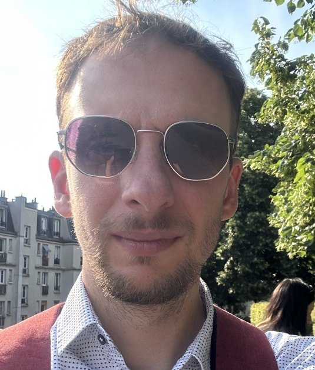

# About Me

## Aleksandar KIRILOV

{ align=left width="256" }

I am a software engineer with 14+ years of experience, mostly autodidact.
I work with Java, Python and Javascript Frameworks, but I can tinker with C, Go and other languages.

I am a DDD and TDD advocate and try to challenge team members to always learn more and perform better.

I love working with Linux and I preach the usage of Free[^1] Software.
I host a small Kubernetes cluster at home and have my own "home cloud", including the blog you are reading now.

I have Studied at the University of Luxembourg.

For more details, check my [Curriculum Vitae](cv.md)

[^1]: Free as in Freedom
