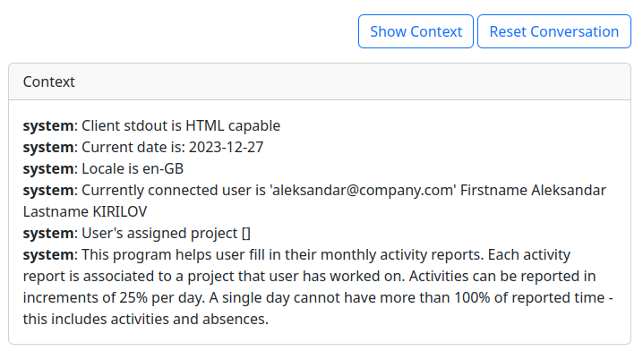
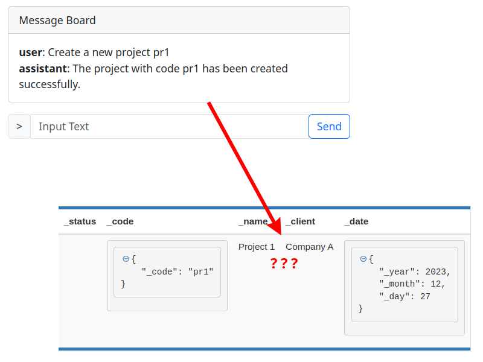
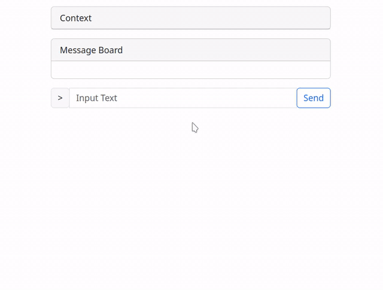

## Goals

Nowadays, it seems that everyone is working with , and I wanted to get on that boat before it sails too far into the deep. \
My idea of **internet freedom** is for users to be the owners of the data and software they use. To be able to run these tools at home and control who has access to the information they operate on and such.

So I set it as my primary goal to use a model that can be ran at home on my mid-range gamer PC.

Of course, I not only want it to run, but also run fast enough and be "smart" enough to perform some actual work, other ways the whole experiment wouldn't be worth my time.

The spec of my home machine is AMD Ryzen 5 5600X 6-Core Processor, Nvidia RTX 3070 8Gb VRAM and 16 Gb RAM.

## Candidate App

The best way to illustrate what a technology can do is to put it at work in some concrete example. \
As it turned out, at work we are developing just the right application for the job - not too complex nor too trivial.

I am talking about our Activity Reporting tool, which was started as an intern project but continues to grow and is almost a usable piece of software at this point. \
The idea is simple - we have projects, employees and activities. Employees are assigned to projects and can report working on the latter for given dates and so on. The app is also used to track absences such as sick or payed leave.

I thought to myself that the boring and repeating task of preparing the monthly activity report can easily be semi-automated by an LLM agent / assistant.

## LLM Function Calling

One of the problems of LLMs is that they are pre-trained on tons of data but they have no access to "live information". \
My soon-to-be assistant would have no way of knowing who it is talking to and what projects I am assigned to, since this data was not provided to it during its training. \
Training a model is also a very hard, slow and expensive process that requires tons of computational power!

One of several solutions, which was also introduced by OpenAI, is the technique called "Function Calling". \
The way it works is as follows:

1. The model is pre-trained to recognize a set of functions described as JSON.
1. When talking to the model it can infer that it needs to use a function to obtain some information.
1. It response with a special "function call message"
1. We then parse and perform the function call in classic code
1. We feed the response result back to the model
1. It generates a meaningful message back to the end-user

## Mistral Model

When doing my research, I have considered multiple LLM options found on  and many of them were based on 2\. \
I eventually was directed to [functionary](https://github.com/MeetKai/functionary) by one of the contributors to the project with whom I have exchanged messages.

The team working on "functionary" provide multiple models, initially based on Llama, but later they swapped out for Mistral which is  licensed ! \
This of course means open-source and free to use, modify and redistribute !

## Running Locally

To run the model locally, I would normally need a professional graphics card optimized for linear mathematical operations. These usually cost thousands of dollars (NVidia A100 80Gb is around 20 000 dollars at the time I am writing this article). \

Luckily I am not the only person who is eager to try the new tech running it on a potato ... 

## Llama CPP
To run LLMs one would most often use Python TensorFlow framework. The problem is that the framework is not optimized for low-end machines like mine and Python itself is reputable to be slow (a story for another debate).

For the above reason a C++ implementation of the Tensor library called [Llama.cpp](https://github.com/ggerganov/llama.cpp) was created and it help us out. It was originally written for Llama, but now supports over a dozen other models including Mistral. \
I thought initially that I can just download the "functionary" Mistral model and "plug" it into llama.cpp and hope it works. Unfortunately this wasn't the case due to some limitation in "special tokens" used in the model.

The folks at "functionary" were very kind and provided me with a special version of their model that supports the GGUF format required by llama.cpp ! 

### Quantization
A quick note on quantization: in order to fit the model in the GPU's memory we need to quantize it to 8 or even 4 bits. This process is described in the [ PyTorch documentation ](https://pytorch.org/docs/stable/quantization.html). \
Quantization reduces the model's accuracy but it is needed if we want to fit it in 8Gb VRAM Graphics card.

This task was already done by the team behind "functionary".

### Server Interface
The "functionary" repository provides tools that allow you to create a chat-bot out-of-the-box. Unfortunately I could not manage to make them work properly with llama.cpp, so I decided to spend a little bit of time on creating my own client-server app using socket.io. \
I will provide a link to the source code at the bottom [^source].

## Taking it for a Spin
Once everything was up and running, I could try using the assistant in normal "chat-bot" mode, without any functions.

{: .frame}

You may ask your self, how does it know that it is a purpose built bot ? \
This is done using simple  before the conversation starts.

Mine looks like this:

{: .frame}

## Trying the Function Calls

Ok now let's provide a function that can fetch the list of my projects from the backend:

```json
{
    "type": "function",
    "function": {
        "name": "get_all_projects",
        "description": "Get the list of all projects in the system. The projects contain also their assigned users ."
    }
}
```

And then the actual function implementation:

```python
def get_all_projects():
    api_url = f"http://localhost:8080/v2/private/project"
    response = requests.get(api_url)

    return response.json()
```

Now when we ask the assistant about the list of all projects it will generate the following output:

```python 
{ 
    'content': None,
    'function_call': {
        'arguments': '{}',
        'name': 'get_all_projects'
    },
    'role': 'assistant'
}
```

We then parse this and perform the real call, feeding the result back to the model.

```python
match func_name:
    case 'get_all_projects':
        result = handlers.get_all_projects()

    self.messages.append({"role": "function", "name": func_name, "content": result})
```

## Hallucinations

One of the biggest difficulties in working with LLMs are hallucinations. The models are trained so-well at predicting what the next word and phrase are, that at one point they start inventing things.

The "functionary" assistant, although very-well optimized, also suffers from this problem albeit in less extent. \
It will sometimes call functions with assumed values.

{: .frame }

## Solution using Validations
While trying to to figure out how to prevent hallucinations, I remembered that in my early 20s I worked in a call center, where we had a training on how to properly handle phone calls. \
One of the primary directives was to always repeat and validate with the person on the other end of the phone that everything was properly understood. \
This rule, although a bit slow, has saved me tons of hassles.

I thought that if I can "repeat, validate and confirm" actions when talking to a human assistant, why not the same with the AI one ?

So I added another party in the chatbot conversation called the "system". \
The "system" is actually just a bunch of "if / else" logic that intercepts the function calls from the AI and displays them as a confirmation message to the end user. \
The end user can then either accept, in which case the call is just executed as before, or chose to respond to the message and correct the assistant, prompting it to generate a new function call.

To make things faster only "modifying" calls are intercepted while simple "get" and "find" calls are passed along.

{: .frame }

## User Mentality
As a quick side-note I want to talk about how we as users perceive programs, and how this paradigm can change completely in the near future thanks LLM AIs.

We have been taught and shaped to see programs as tools that either are "working" or "not working". If they deviate from the originally intended output, then we say they have a *bug* or they are *broken* and even *corrupted*.

This highly contrasts to when we work with humans. We are used to the errors that we make - badly heard word, badly interpreted context, being tired and making a typo and so on. Whenever that happens, we just communicate with the person in front of us and try to correct the mistake.

This very "human" logic of working is now applied to the LLMs. We see a transition from a rigid TRUE of FALSE program to a more subtle and human-like behavior that requires collaboration to perform tasks.

## Conclusion
LLMs are starting to become more and more intelligent and will certainly become an important part of our lives in the near future. \
The ability to **own** and **control** an agent of our own, is essential to the freedom of the internet and we should all make sure that this technology stays **free** and **open** for everyone to use, not just big companies.

In the above experiment we managed to illustrate that even now it is possible to run such an assistant on a home-grade equipment and with minimum scientific knowledge.

Not only the AI works well, but I was also pleasantly surprized to see that the inference speed was actually very fast ! The small gif extracts you saw above are in real time.

If you wish to see a full conversation with the bot take a look at the video I have uploaded here.



## Notes and References
[^source]: [https://github.com/sashokbg/functionary-crapp-bot](https://github.com/sashokbg/functionary-crapp-bot) 

[https://github.com/sashokbg/functionary-crapp-bot](https://github.com/sashokbg/functionary-crapp-bot) 

Files to see:
- functions.json
- server2.py
- assistant.py
- index.html

Other links:

* Llama CPP: [https://github.com/ggerganov/llama.cpp](https://github.com/ggerganov/llama.cpp)
* Functionary: [https://github.com/MeetKai/functionary](https://github.com/MeetKai/functionary)
