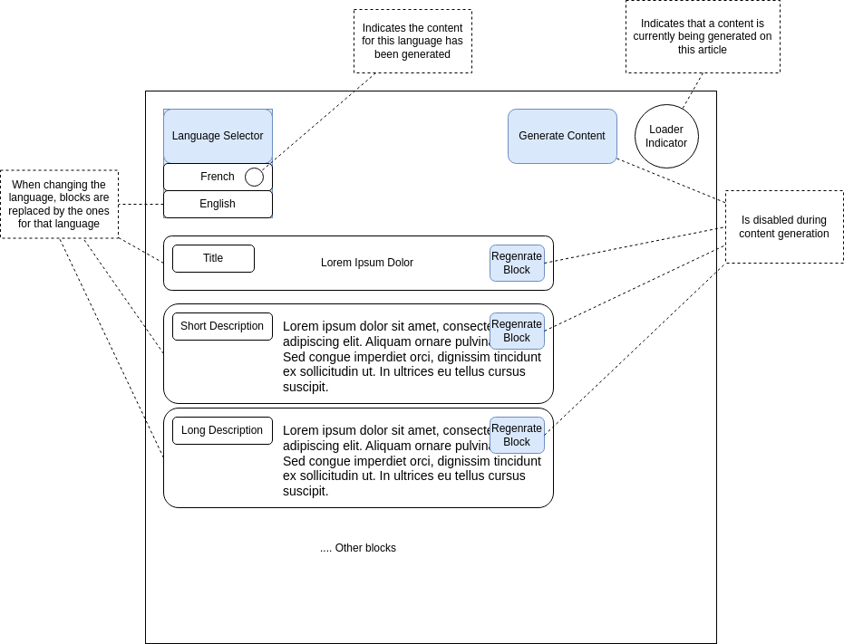
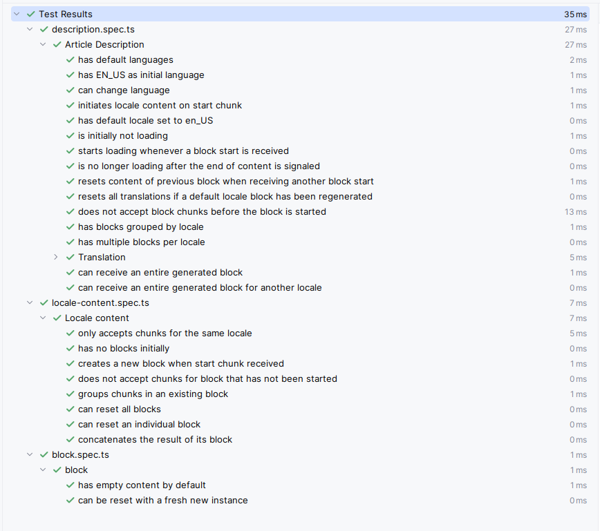
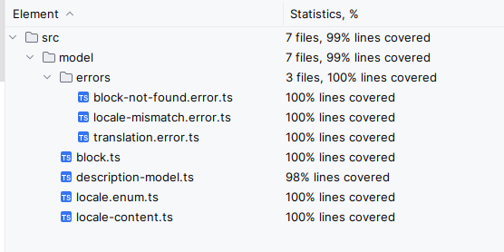

# Studying Domain\* and Test Driven Design Principles in Frontend Applications

*\* Disclaimer: When talking about DDD in this context, I mainly mean the use of an expressive and rich model*.

During my career as a web-developer, I have noticed a repeating antipattern related to front-end code. For some reason most of the best practices that we usually use on the backend code are rarely applied in the front. This looks especially true for DDD and TDD principles.


In this article I want to showcase how some DDD and TDD best practices can be used in a classic _React_ application with a little help of a reactive framework called _Signals_.  
I will treat the matter as a study and try to gain knowledge and insights along the way.

Please note that this is **not** a showcase for the technical aspects of how _Signals_ work, but rather an example of how frontend business logic can be developed using TDD and DDD.  
In our examples _Signals_ can be easily replaced by RxJS or simple callbacks, and everything will still hold.

## What is a Model?

Domain Driven Design is a very vast discipline, and I want to mainly focus on the modeling parts of it, such as aggregates, [value objects](https://en.wikipedia.org/wiki/Value_object), [encapsulation](https://en.wikipedia.org/wiki/Encapsulation_(computer_programming)) and in general the **model**.

Let's take a moment to talk about what a model is, but also what it is not.

One of the biggest _sins_ of modern development is that we have forgotten what a OOP is and what a model is supposed to be. We create simple classes that are just containers for data and that are void of any logic whatsoever and call that a "model".

A model is an abstraction of reality that represents some real-life objects, patterns and interactions in a simplified way.

I often explain the principle to my colleagues with the analogy of the solar system and the way celestial objects gravitate around each other and the sun.

In the celestial model we represent multiple invariants that are observable in real life such as:

- All planets revolve around the sun
- No two objects can collide in the solar system
- All planets turn in the same direction
- When the Earth completes one revolution around the sun, the Moon completes 12 around the Earth
- Etc ...

If we represent the solar system by a simple class that only has fields with getters and setters, we would have an [anemic model](https://martinfowler.com/bliki/AnemicDomainModel.html) that does not protect its state and does not enforce the invariants mentioned above.  
Any time we expose a field via a _setter_, we completely neglect the rules of the system and our code becomes error-prone.

As an example, imagine we have the class _SolarSystem_ that has a setter for _Earth_'s position. This means that if an external caller gets a reference to the _SolarSystem_, then nothing stops them from setting the position of our planet to _(0, 0, 0)_ colliding it with the center of the _Sun_.  
Our model should thus have a method called _"advance(time)"_ and the position of all planets should be calculated internally.

Take a look at the orrery bellow (meaning Model of the solar System) and how it is self-validated. There is only one way to interact with the model, through a crank at the bottom that can only be turned in one direction. Everything else in the model is internally calculated and cannot be mingled with.

*A physical model of the Solar System - an orrery*


*The model's invariants are cleverly designed using sprockets and gears*


_Credit to [Pinar Noorata and Ken Condal mymodernmet.com](https://mymodernmet.com/author/pinar) for the beautiful orrery._

## Real Life Use Case

So having in mind what a model is let's now study a more realistic and concrete case that I have encountered while working on a project at my company.

Here is a short description of the problem:

We are developing an application that uses an AI LLM model to generate an article's content.

An article is split into different blocks, such as title, short description, bullet points and long description. Each block has its own AI model that is responsible for generating the appropriate content.  
An article can be translated into multiple languages, and the blocks' content is changed for each language.

### Websocket Protocol

We have opted for a websocket communication with the backend in order to leverage the asynchronous mode of AI content generation. A custom protocol has been developed that works in the following manner:

1. The frontend app establishes a websocket connection with the backend

2. The frontend performs a POST request to the backend to initiate the beginning of the article's content generation.

3. A "Start block" message is sent from the backend to the front.

4. After this the websocket receives a number of chunks of content for that block. Whenever a new "Start block" is received the UI needs to visualize a new block and all consecutive chunks will be appended to it.

5. Return to **3.** until all blocks finished

6. The communication is ended with a special "end of content" message.

### Additional Rules

There are also some additional rules related to how the UI should behave during the content generation:

* Rule: An article indicates that it is "loading" content as soon as the first Start Block message is received.

* Rule: An article stops loading whenever the "End of Content" message is received.

* Rule: The current locale (language) can be changed from a predefined list.
 
* Rule: Whenever changing a locale, if the content for this locale is not yet generated, the model requests a translation from the backend. The same websocket protocol is used for translations.

* Rule: Whenever the locale is changed, If the selected locale has already been generated, then the content of the blocks is swapped with the corresponding locale.

* Rule: The entire article content can be regenerated. This will reset the content of all blocks and will remove any existing translations.

* Rule: A single block's content can be regenerated. This action resets all translations.



## Initial Approach and Fail

As you can see, the UI rules are fairly complicated, but what adds event a bigger challenge is the asynchronous communication with the backend.

Our team has initially started developing in a classic React manner:

A wrapper component that has some children. Each child is representing some visual part of the screen, such as the article and its block and their content.

Concerning the state, and this is where things went really wrong, we used React's _useState_ hooks and component _properties_ in addition with _callback_ functions to pass state changes and events between parent / children.

We quickly ended-up with an entangled mess of data and callbacks being passed multiple levels down. One such example is the relation between the "regenerate block" button that needs to trigger the global loader's state.  
We started running into various bugs and problems, and the time spent fixing issues was steadily increasing to the point where we barely could add new features.  
Other bugs we encountered were related to content being mixed between blocks and languages etc.

Although our team had some experience with React, we were not fluent with [React's Testing Library](https://testing-library.com/docs/react-testing-library/intro/).  
This is actually one of the major problem with modern SPA frameworks, such as React and Angular, that testing them is not trivial and requires libraries, fixtures, mocks etc.

## Applying TDD & DDD

As a seasoned backend developer, I started searching for analogies in my experience. When I encounter a badly written, highly coupled code, I usually apply the following strategy:

- Write a test that describes what we want to actually achieve.
- Ideally make the test red / green with the existing code.
- Write a new DDD **non-anemic** model that validates the tests.
- Decouple the existing code from the old classes and make it use the new model.

I thought:  
"Why not use the same principle in my React code ? What makes it any different from any backend code I have written ? Why should I tolerate this spaghetti coupling of presentation and business layers ?"

I then proceeded by starting a new empty project to avoid any distractions. I only installed Jest as a dependency and started writing all the business rules we have mentioned earlier in TDD style.
My model slowly started emerging as I was progressing with the tests. Each class and method was created during the test initialization.

*All business rules were described by the tests.*


*Consequently, the test coverage was close to 100%*


### DDD Model

Since my model was completely decoupled from React, or any other technical libraries in-fact, it was easy to properly use some DDD patterns, such as aggregates and value objects.

Most of the fields of my aggregates were private and had no setters, making sure that no data inconsistent operations can be made upon the model.

```typescript
/**
* This class is the main aggregate that manages the description of an Article.
* It provides operations such as #addChunk, #addStartChunk etc. for adding content to the appropriate blocks.
*
* The description comprises multiple LocaleContent.
*/
export class DescriptionModel {
  private readonly _languages: LocaleEnum[];
  private readonly _localeContents: Signal<LocaleContent[]>;
  private readonly _currentLocale: Signal<LocaleEnum>;
  private readonly _defaultLocale: LocaleEnum;
  private _run_id = "";
  private readonly _isLoading = signal(false);
  callback: any;
  

  constructor() {
    this._languages = [LocaleEnum.en_US, LocaleEnum.fr_FR, LocaleEnum.en_UK];
    this._currentLocale = signal(LocaleEnum.en_US);
    this._localeContents = signal([]);
    this._defaultLocale = LocaleEnum.en_US;
  }
  // getters
  // mutators
}
```

Most of the business logic was properly encapsulated inside the aggregate and not split into a service. True OOP was achieved by combining data and functionality.

```typescript
export class DescriptionModel {
  // ... class initialization omitted
  // ...
  addStartChunk(chunk: BlockStartChunk) {
    let localeContent = this.getLocaleContent(chunk.locale).value;

    if (!localeContent) {
      localeContent = new LocaleContent(chunk.locale);
      this._localeContents.value = [
        ...this._localeContents.value,
        localeContent,
      ];
    }

    const existingBlock = localeContent?.getBlock(chunk.name);
    if (existingBlock) {
      localeContent.reset(chunk.name);

      // if the default locale content has changed, remove all translations
      if (chunk.locale === this.defaultLocale) {
        this.removeAllTranslations();
        this.changeLocale(this.defaultLocale);
      }
    }

    localeContent.addStartChunk(chunk);
    this.isLoading.value = true;
  }

  addChunk(chunk: BlockChunk) {
    const localeContent = this.getLocaleContent(chunk.locale).value;
    if (!localeContent) {
      throw new BlockNotFoundError(
        `Unable to find block ${chunk.block_name} for locale ${chunk.locale}.`,
      );
    }
    localeContent.addChunk(chunk);
  }
  
  // ... other mutators
}
```

The end result was very nice: when using this well-structured and completely tested model, I could completely forget about the complexity of properly updating the article's blocks, properly filtering the language and translations, updating the loading status etc.  
It became a "fire and forget" solution where I only had to receive a piece of information from the websocket, and invoke the _descriptionModel.addChunk()_.  
All the rest was automatically calculated, updated and validated by the model.

### Celestial Model Analogy
Let us return to our celestial model for a moment and compare:

- Not having setters in the article description model is the equivalent of not allowing the planets to be moved by hand
- Having limited interaction points with the model, such as "addChunk", is the equivalent of having only one crank in the celestial model
- Internally calculating / mutating the state of the model, such as adding the chunks to the proper language and block is the equivalent of making the planets rotate in the right way, when turning the crank.

### Psychological Effects and Ease of Mind
I want to point out that besides the obvious technical advantages of having a well-defined model, there is also an important psychological factor.

It is hard to explain how huge is the transition from a buggy, messy code, where each manual test took from 2 to 3 minutes, to a well-defined, well-tested model that just works.

Adding new features is now much easier. Knowing that I can play around the code and try new things without worrying about breaking the rest is an enormous relief. It is way-more motivating to work on this part of the project for these reasons.

## Components Integration

Now that we have properly developed and hydrated the new model, we need to find out how to put in actual use in the React application.

My initial and naive approach was to use the entire aggregate as the state of the wrapper component. This idea quickly fell down the drain due to numerous problems such as:

- Due to the nature of how changes are detected in reacting, it was necessary to deep-clone the entire object graph on every change
 
- Performance - recreating an entire graph is very expensive
 
- It is impossible to make child objects react to changes of a sub-graph of the model.


It seemed that I had to make a compromise and add some library to update the view in a dynamic manner. After some consideration I stopped myself on [Preact's Signal](https://preactjs.com/guide/v10/signals/) framework.

_I will talk about other possible solutions I considered further down._

For every action, on which the view had to be updated, I had to expose either a _signal_ or a _computed signal_. 

*The model needed a simple transformation*
```typescript
// from
export class DescriptionModel {
  private readonly _languages: LocaleEnum[];
  private readonly _localeContents: LocaleContent[];
  private readonly _currentLocale: LocaleEnum;
  private readonly _defaultLocale: LocaleEnum;
  private _run_id = "";
}
```

*Wrapping the model's fields as Signals whenever a component needs to subscribe and react to it changing*
```typescript
// to
export class DescriptionModel {
  private readonly _languages: LocaleEnum[];
  private readonly _localeContents: Signal<LocaleContent[]>; // <-- wrapped with Signal
  private readonly _currentLocale: Signal<LocaleEnum>; // <-- wrapped with Signal
  private readonly _defaultLocale: LocaleEnum;
  // ...

  get localeContents(): Signal<LocaleContent[]> {
    return this._localeContents;
  }

  // Some methods can calculate a Signal's value, based on other signals
  getLocaleContent(locale: LocaleEnum,): ReadonlySignal<LocaleContent> {
    return computed(() =>
      this._localeContents.value.find((loc) => loc.locale === locale),
    );
  }
  
  // .. etc
}
```

On the component side, things were as easy as: 

*Create my model in the JS context (outside the component)*
```typescript
const description = new DescriptionModel()
```

*Use the Signal's value inside the tsx template*
```html
<div>Content is loading: {description.isLoading.value ? 'True' : 'False'}</div>
```

## The Code for the Study

The entire example covered is available on my Github repository at https://github.com/sashokbg/react-tdd-ddd-study

## Other Possible Solutions - Redux, Immer and DeepSignals

Some of the more experienced React developers would probably immediately have shouted "use Redux !". Redux provides the essential concepts such as basic encapsulation of the state, methods via the _reducers_ etc. As such it is a viable solution for a feature-rich UI that requires advances state management.

There are, however, sever drawbacks of using redux such as additional dependencies, a certain opinionated way of doing things the "redux" way.  
Redux is also not really OOP-oriented, since each reducer receives the previous state and returns a new one and is not really how a classical object would mutate. This is ofcourse completely fine and brings us back to the old "functional vs OOP" debate.

Immer is probably another solution that could have easily replaced the Signals, but it looks like it has the same "drawback" of being functionally based.

DeepSignals library is very close to how Signals work but automatically wraps entire object graphs, making all fields Signals. An advantage of deep signals is also that you don't need to use the _.value_ to subscribe to a signal change.  
I choose not to use it since it is not very popular for now and since it adds additional complexity with the object proxying etc.

## Conclusion

The study and the model I have described are now happily integrated in our project. It probably needs to spend some more time with the rest of the team and in production to make sure that this is the way to do things.

Either way, I am delighted with the outcome, and I think that this study proved that the best practices can easily be applied on frontend / UI code. There are no excuses to skip tests, to create anemic models and not to focus and explicit domain requirements.

All of these are easily achievable with a minimum of technical requirements and are mostly related to skills, project culture and the will to build better applications.


## Links and References

- https://preactjs.com/guide/v10/signals/

- https://jestjs.io/

- https://mymodernmet.com/ken-condal-orrery

- https://martinfowler.com/bliki/AnemicDomainModel.html

- https://en.wikipedia.org/wiki/Domain-driven_design

- https://immerjs.github.io/immer/

- https://redux.js.org/
