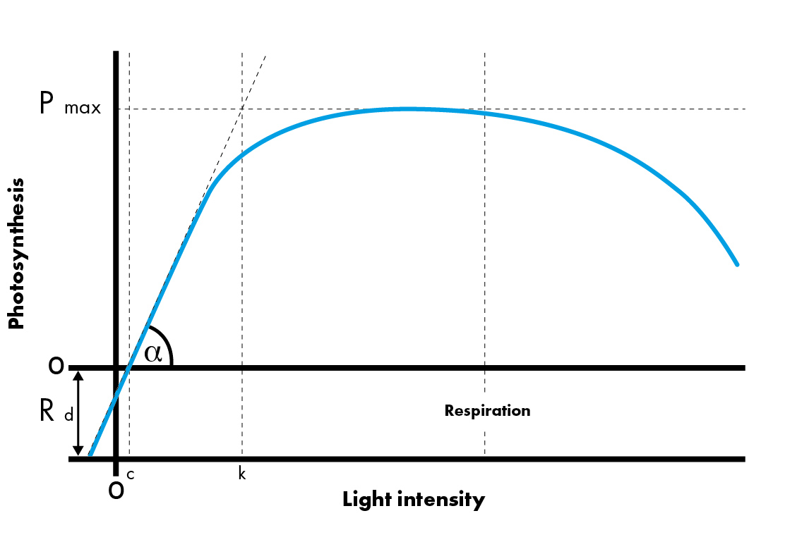
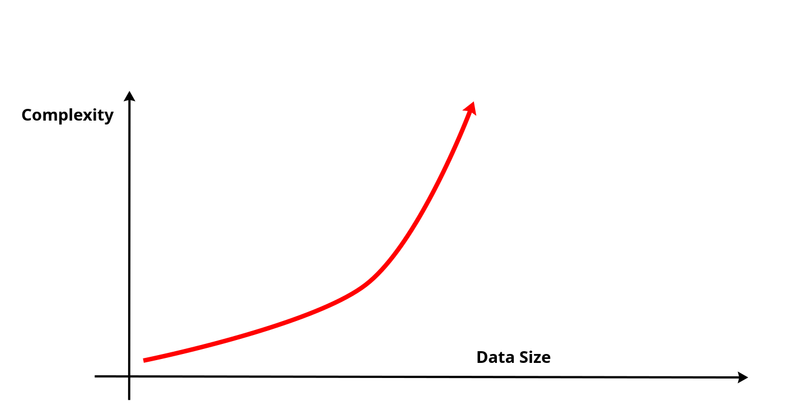
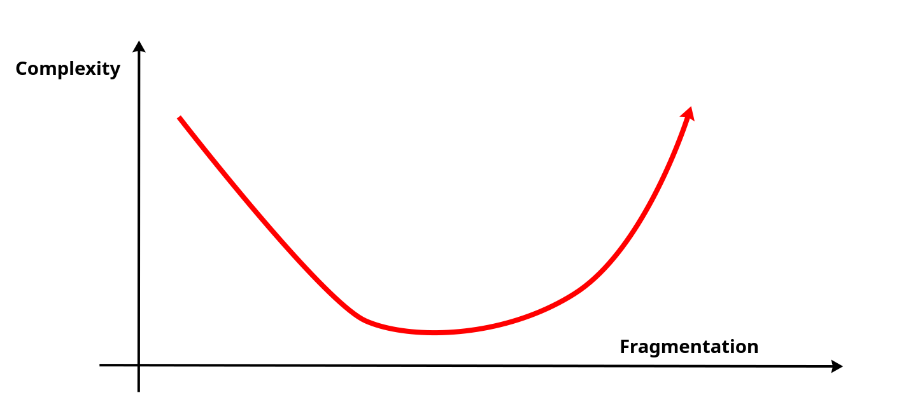
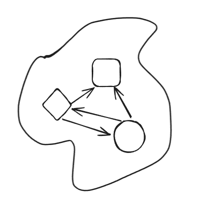
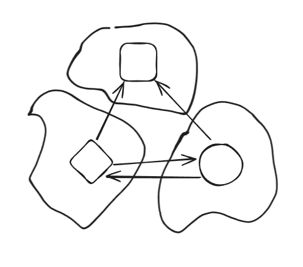

# Please Stop Splitting Things

As engineers, we learn from the very beginning that bundling too many things together is bad. Be it writing a huge
function or a class file, having thousands
of lines.
The same holds true for non-technical aspects such as project documentation, project tickets, etc.

<!-- more -->

We have been thought to always avoid the so-called "God Classes" that are huge chunks of application that seem to do
everything.

There are many good reasons to avoid the abovementioned antipattern. I will not dive too much into these, since there
are tons of good reads on this subject if you search for terms like low coupling, single-responsibility, easy
testability, etc ...

## Tipping Point

There is, however, a tipping point, beyond which splitting items into smaller ones becomes less efficient.
Just like many processes in nature, where increasing the input of a system, the returns become diminishing or even
negative.

One such example is light-to-sugar production in photosynthesis. The more we put light into the system, the more sugar
the plant produces, but the returns are diminishing. At a certain point, the chart event tips downwards, since the
chlorophyll is killed by the intense light.

{ width=320 align=right }

Another very similar example can be observed with voltage-to-current relation, where after a certain point, we start
seeing diminishing returns until the conductor melts from overheating.

In my opinion, splitting code, or other pieces of information like files, documentation, and jira tickets, behaves in the
same manner. We initially gain productivity from simplifying some parts of our system, but eventually over-fragmentation
bogs down the entire system until it becomes unusable.

## Perception of Small Changes

As humans, we ofter struggle to perceive changes when they are tiny. Think of how seeing the same person for years every
day, we don't notice them grow or age until we see an old photo.  
The same can be observed with the day-to-day productivity and efficiency of our projects.  
The big issue comes from the tipping point of the curve of code fragmentation.  
Let me explain:

Measuring cognitive load of a single monolithic entity is done more-or-less in a linear manner. The complexity grows the
more we add code to our class and the harder it gets to read, end of the story.

Measuring the complexity, when we split things into smaller chunks is an inverse bell, and this is where issues arise.
At first, it seems very beneficial to split our documents and classes into smaller chunks. We can easily understand
small bite-sized parts of the system instead of digging through one huge data piece.

We think that we are on the right path and just continue doing it. New pieces of information are constantly added in new
documents, new classes, since we also have the bad habit of copying existing patterns in a project without giving much
thought.

At one point we arrive at the tipping point where we start again increasing complexity and reducing productivity.  
The worst part is that we do not even realize it due to our inability to see small changes (like the example we gave
with aging). Before we know it, we end up with an over-fragmented project that lacks consistency and becomes as
cumbersome to maintain as the original monolith.

## Why Over Fragmentation is Bad

One of the main issues of fragmentation is the tendency to repeat things. It is really hard to know if a functionality
already exists in our project if we have to search in 100 classes for it.  
It becomes even worse when these files are split into multiple git repositories. Sometimes it is actually completely
impossible since we don't even know where to look for (imagine a git repository that you didn't know of)

In other words we are lacking a `single source of truth`

Over fragmentation also leads to increased coupling. This sounds very counterintuitive, since we started splitting our
code precisely to reduce coupling in the first place.
Unfortunately, even if we split one class into two, or one service into two microservices, if these two still depend on
each other, either by call or by sharing data, then we actually increase coupling.

In short, decreasing coupling is not possible without taking into consideration **cohesion**.  
Cohesion is where things get a lot harder. Splitting things is straightforward, it barely requires any thought and can
be done fast. Creating real cohesion in your project is extremely hard and requires lots of thought and careful
planning.  
(I strongly recommend reading DDD Strategic Design from Eric Evans !)

<figure markdown="span">
    

        { width=250 }
        { width=250 }
    

    <figcaption>Coupling in monolith vs fragmented</figcaption>
</figure>

## Context Switching and Cognitive Load

We have talked about the technical and architectural aspects of fragmentation, but there is also the more human and
cognitive side to it. In simple terms, switching contexts is hard on your brain.

Here is a basic example to illustrate what I mean:  
Take the names of your family members and write them one after the other and time your task.

Now take the same list and write the names, but this time write them vertically - meaning the first letter of each
member, then you write the second letter and so-on.  
As you can see, not only it is way harder and slower, but I even made an error in my own name, and I promise you it was
not intentional!

<figure markdown="span">
    

      
      
    

    <figcaption>Illustrating Context Switching</figcaption>
</figure>

## Microservices

When thinking of examples of project fragmentation, the first thing that comes to mind is the microservices architecture.
This one fad from the 2010s has, in my opinion, caused the most havoc of all.

Many projects have inherent complexity associated with them. Imagine developing an entire scheduling system for bus drivers, managing shifts, driver absences, etc.  
No amount of magic architectural decisions will simplify the problem (although wrong ones will make it a lot harder!).  
What we end up doing is just shifting complexity from one place to another.

I have worked as both developer and devops on the same project that was migrated from monolith to microservices. I observed how, by splitting the code base, to ease the day-to-day tasks of developers, we made it extremely difficult for devops to deploy, monitor, and operate the product.

We effectively just moved complexity from one part of the project to another but have not reduced it. This could still be a valid thing to do if we have a huge imbalance!

Microservices worked very well for some companies like Netflix, but they succeeded by careful planning and strategic
decisions. Most importantly, they started with a monolith and later split it into smaller peaces.

For the rest of us, microservices often represent just an unnecessary over-fragmentation that can easily spiral out of control and get us over the tipping point of productivity.

## Git Repositories

Another example of fragmentation is the multi git repository. I have seen simple 4-5 screen web apps split into three or four git repositories.  
Frontend, backend, deployment, shared libs, and so on.  
It seems that we often mistake "monolith repository" with "monolith software", which are of course different.

It becomes difficult to instore any consistency between these projects. Things get even worse if you are a full-stack developer and often end up doing three or four commits for a single feature.

In my opinion, developers fall in this antipattern because of lack of proficiency with git, fearing conflicts, rebases, etc.

## Codebase Packages & Files

We can trace the avidity for splitting things all the way down to the code.  
From functions that are only two lines to packages containing one source code file, we love splitting things—it makes us feel "organized".

I sometimes see developers who barely wrote any code in their fresh project, spend hours creating empty packages and shell classes. Instead of just getting some work done and split things on the fly, they spend their time imagining the structure of the project, most of which will never serve any purpose.

## Conclusion

Working on a large project often means having to dig deep into other people's work. Having to search for hours for the precise place to surgically modify the code.
This exercise is painstakingly hard, and we naturally tend to prefer creating our own corner, where we understand things, where we are in control, where it is simpler.

We like fragmenting things because we don't like to have to sift through all the complexity of the existing system, but by doing so, we make the problem even worse.

From classes and packages, to repositories, documentation, and backlog, we multiply and often deteriorate the quality of our projects. Business logic and architecture get diluted into hundreds of places, focus is lost, leadership becomes hard to establish.  
Not having a single source of truth, our ability to accurately plan and implement features is greatly reduced.

And so very often, we don't even realize we are sliding on the slipper slope of fragmentation.

## Links

Here are some links to publications that talk about similar issues:

- [Introducing Domain-Oriented Microservice Architecture](https://www.uber.com/en-FR/blog/microservice-architecture/)

- [Rebuilding Twitter’s public API](https://blog.x.com/engineering/en_us/topics/infrastructure/2020/rebuild_twitter_public_api_2020)

- [From Polyrepo Pains to Monorepo Gains: Our Migration Journey at Inkitt](https://medium.com/inkitt-tech/from-polyrepo-pains-to-monorepo-gains-our-migration-journey-at-inkitt-6beb6734f3dd)
